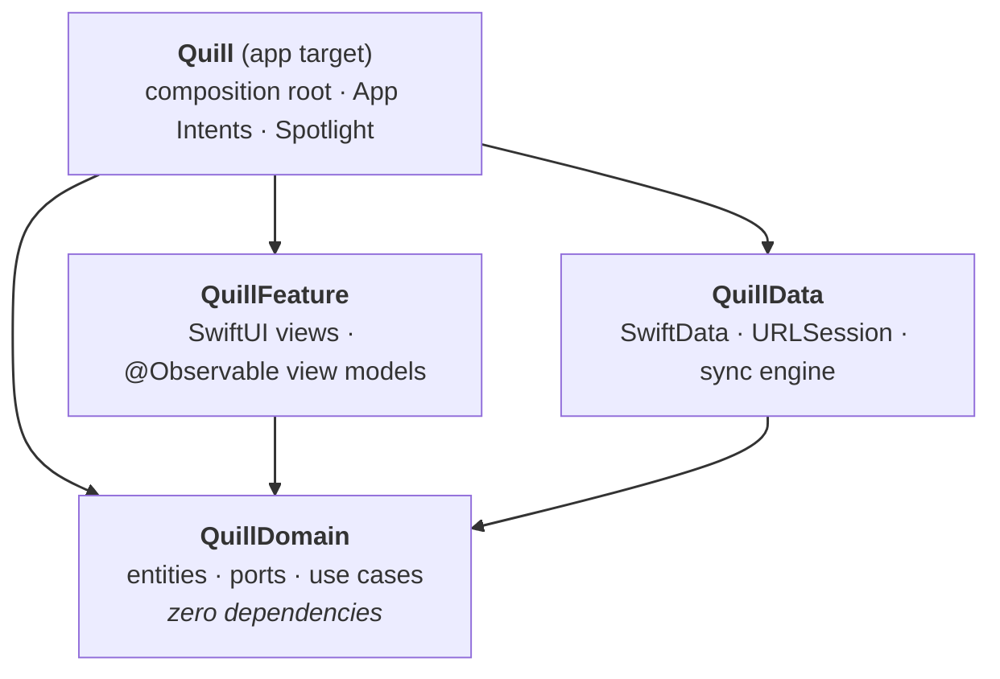

# Quill

An offline-first notes app for iOS, built as a reference for how I structure
production Swift: modular Clean Architecture, Swift 6 strict concurrency, and a
sync engine whose conflict resolution is a pure, exhaustively tested function.

The feature set is deliberately small — write, search, pin, delete, sync. The
engineering around it is not.

| | |
|---|---|
| **Platform** | iOS 18+ (core packages also build for macOS 15+) |
| **Language** | Swift 6.0, full strict-concurrency checking |
| **UI** | SwiftUI + Observation (`@Observable`) |
| **Persistence** | SwiftData behind a repository port |
| **Networking** | `URLSession` + async/await, retry with jittered backoff |
| **Tests** | Swift Testing (`import Testing`) |
| **Project file** | Generated by XcodeGen from `project.yml` |

---

## Architecture at a glance



The one rule that shapes everything: **dependencies point inward, and
`QuillFeature` never imports `QuillData`.**

That is not decoration. It is enforced by the module boundary — the feature target
does not list `QuillData` as a dependency, so a view model *cannot* reach
`URLSession` or a `ModelContext` even by accident. The presentation layer talks to
`ProtoNoteRepository`, `ProtoNoteSynchronizing` and a handful of use cases, all of which are
protocols or value types declared in the domain.

What that buys, concretely:

- View-model tests need no database and no network stub — they run in
  milliseconds against in-memory fakes.
- The domain has no `import` beyond `Foundation`, so its tests are pure logic.
- Replacing SwiftData, or the backend, is a change inside one module.

Full write-up: **[Docs/ARCHITECTURE.md](Docs/ARCHITECTURE.md)**. Decisions and
their trade-offs: **[Docs/](Docs/)** (ADR 001–004).

---

## The parts worth reading first

**`LogicNoteMerger`** — [`QuillDomain/ModelLogic/Merge/LogicNoteMerger.swift`](Packages/QuillCore/Sources/QuillDomain/ModelLogic/Merge/LogicNoteMerger.swift)
Conflict resolution as a pure function: last-write-wins on `updatedAt`, with
tombstones winning ties. No I/O, no clock, no store, so every conflict case is a
one-line test. [ADR-002](Docs/ADR-002-conflict-resolution.md) covers why LWW and
what it costs.

**`LogicSyncNotes`** — [`QuillDomain/ModelLogic/Sync/LogicSyncNotes.swift`](Packages/QuillCore/Sources/QuillDomain/ModelLogic/Sync/LogicSyncNotes.swift)
Pull → reconcile → write locally → push → advance cursor. Every step is
idempotent and the cursor only advances on success, so an interrupted round is
safe to replay. The cursor tracks **server** time, never device time.

**`InteractorNotePersistence`** — [`QuillData/Interactors/Persistence/`](Packages/QuillCore/Sources/QuillData/Interactors/Persistence/InteractorNotePersistence.swift)
A `@ModelActor`, so all store access is serialised by actor isolation rather than
by a lock. `@Model` objects never leave the module: they are mapped to value-type
`Note` at the boundary, which makes it impossible to hand a context-bound object
to another actor.

**`InteractorNoteSync`** — [`QuillData/Interactors/Sync/`](Packages/QuillCore/Sources/QuillData/Interactors/Sync/InteractorNoteSync.swift)
Coalesces overlapping sync triggers into one in-flight round, so "sync on
foreground, on pull-to-refresh, and after every write" is safe to actually write.

**`ViewModelNoteList`** — [`QuillFeature/ViewModel/NoteList/`](Packages/QuillCore/Sources/QuillFeature/ViewModel/NoteList/ViewModelNoteList.swift)
One `State` enum instead of `isLoading` + `notes` + `error`, so illegal
combinations are unrepresentable and the view is a total function of state.
Search is debounced in the view model, not the view.

---

## Features

- **Offline-first.** The local store is the source of truth. Every read and write
  works with no network; sync is a background reconciliation, never a gate.
- **Soft deletes with tombstones**, so a delete propagates between devices
  instead of the note reappearing on the next pull.
- **Autosave** with debounce, flushed on navigation *and* on scene backgrounding
  — the two places typing otherwise gets lost.
- **Siri / Shortcuts / Action button** via `CreateNoteIntent`, which writes
  through the same use case as the UI without launching the app.
- **Spotlight indexing**, with deep links back into the editor. Deleted notes are
  removed from the index, so tombstoned text is not searchable.
- **Accessibility**: composed VoiceOver labels per row, swipe actions mirrored as
  accessibility actions, Dynamic Type through to accessibility sizes.
- **Localised** English and Spanish via a String Catalog, with correct
  pluralisation and compile-checked keys.

---

## Getting started

Requires Xcode 26 or newer.

```bash
git clone https://github.com/ernestgonzalezv/quill-ios.git
cd quill-ios
make project     # regenerate Quill.xcodeproj from project.yml
make test        # run the full package test suite
open Quill.xcodeproj
```

`Quill.xcodeproj` is committed so the repo opens with a double-click, but
`project.yml` is the source of truth — see
[ADR-004](Docs/ADR-004-generated-project-file.md).

The app runs fully offline out of the box. `QUILL_API_BASE_URL` points at a
placeholder host, so sync will fail and surface its banner while local storage
keeps working — which is exactly the degradation path the design is built around.

### Make targets

| Command | What it does |
|---|---|
| `make project` | Regenerate the Xcode project from `project.yml` |
| `make test` | `swift test` across all three package test targets |
| `make build` | Build the app for the iOS Simulator |
| `make lint` | SwiftLint in strict mode |
| `make clean` | Remove build artefacts |

---

## Testing

```bash
make test
```

Tests use [Swift Testing](https://developer.apple.com/documentation/testing), run
on macOS without a simulator, and are organised by the layer they cover:

- **`QuillDomainTests`** — pure logic. Conflict resolution across every
  local/remote combination, use-case rules, ordering, search matching. No fakes
  needed beyond an in-memory repository and a frozen clock.
- **`QuillDataTests`** — the adapters. Retry/backoff schedules against a stubbed
  client and a fake sleeper (so they run instantly), DTO round-trips including
  both ISO-8601 date shapes, and the real SwiftData repository against an
  in-memory container.
- **`QuillFeatureTests`** — view-model state machines: every transition, debounce
  behaviour, and the rule that a sync failure must never blank a loaded list.

Time and randomness are injected everywhere (`ProtoDateProvider`, `ProtoSleeper`, the
jitter closure), so there are no sleeps and no flakes.

---

## Roadmap

Deliberately not built yet, and honest about it:

- WidgetKit extension for pinned notes
- Rich text, attachments
- CRDT-based merge to preserve concurrent edits ([ADR-002](Docs/ADR-002-conflict-resolution.md))
- Background refresh via BGTaskScheduler
- Snapshot tests for the list and editor

## Licence

MIT — see [LICENSE](LICENSE).
